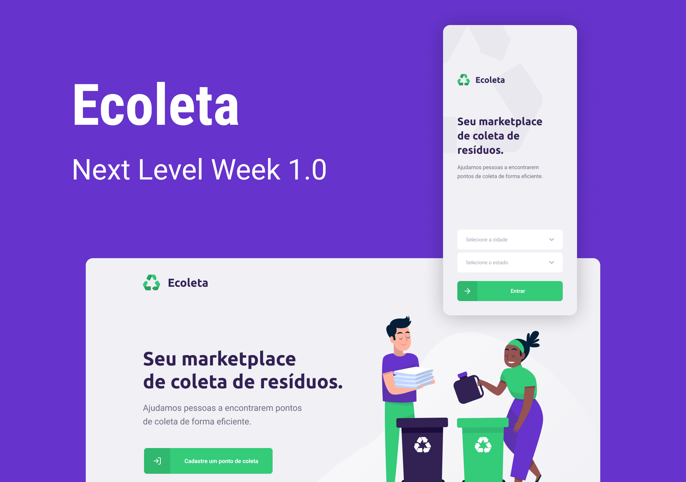
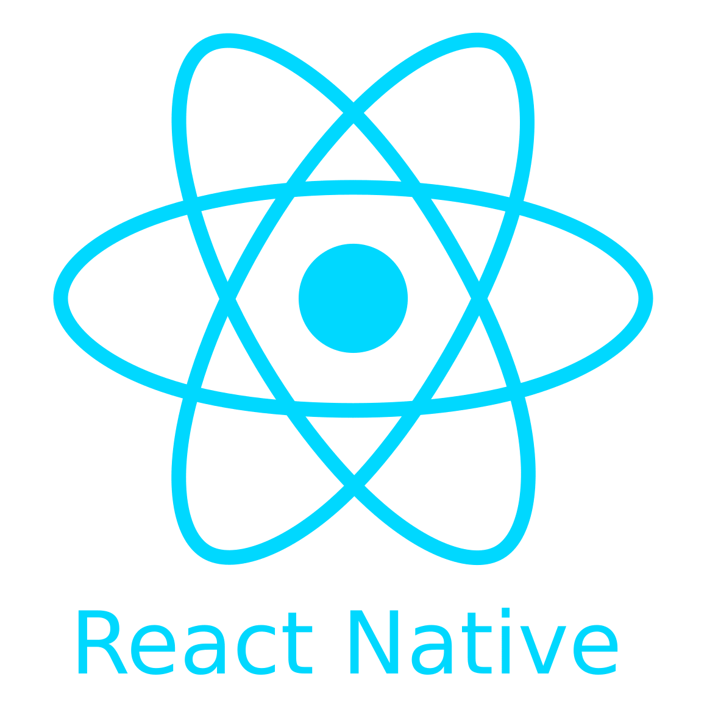

<h1 align="center">
    
</h1>

<div style="margin: 10px">
  Durante uma semana foi desenvolvido uma API do sistema Ecoleta, que possibilita que locais que realizam coleta de matériais orgânicos e inorgânicos cadastrem-se e que pessoas que procuram esses locais possam entrontra-los. 
  Também foi desenvolvido os frontends web e mobile para essa api: neles utilizamos uma integração com mapa, para que o local do ponto de coleta seja marcadoo e encontrado com mais exatidão; e também uma api do IBGE que permite ao usuário selecionar a UF e suas respectivas cidades.
</div>

##### Funcionalidades
  <li> Cadastro do ponto de coleta com upload de imagem; 
  <li> Cadastro do ponto de coleta com possibilidade de seleconar no mapa o endereço (recolhendo a latitude e longitude do ponto); 
  <li> Cadastro do ponto de coleta com select integrado com api o IBGE, assim fornecendo todas as UF e suas respectivas cidades existentes;
  <li> Busca de pontos de coleta por cidade e por item coletado;
  <li> Possibilidade de entrar em contato com o ponto de coleta por whatsapp, redirecionando através do próprio app;
  <li> Possibilidade de entrar em contato com o ponto de coleta por email, redirecionando através do próprio app. 


## 🛠 Ambiente de Desenvolvimento

### - Back-end
  <h1 align="center">
    
  </h1>
  
  <li> Fremework: <a href="https://expressjs.com/pt-br/"> Expressjs </a>
  
  <li> Banco de dados: <a href="#"> SQLite </a>
  
  <li> Construtor de consultas SQL: <a href="http://knexjs.org/"> Knexjs </a>
  
  <li> Para validação: <a href="https://github.com/arb/celebrate"> Celebrate </a>
  
  <li> Facilitaor: <a href="https://insomnia.rest/"> Insomnia </a>
  
### - Fron-end web
  <h1 align="center">
    
  </h1>
  
  <li> Para validação: <a href="https://github.com/jquense/yup"> Yup </a>
  
  
### - Fron-end mobile
  <h1 align="center">
    
  </h1>
  
  <li> Facilitador: <a href="https://docs.expo.io/"> Expo </a>
  

## 🚀 Iniciando a aplicaçaõ na sua máquina

```
//Instala o express
$ npm install express 
//Usando typeScript
$ npm install @types/express

//Instala o knex
$ npm install knex 

//Instala o banco de dados sqlite3
$ npm intall sqlite3 

//Instala o celebrate
$ npm install celebrate 
//Usando typeScript
$ npm install @types/celebrate

```


## 🎞️ Protótipo

<a href="https://www.figma.com/file/QeJnO1XeVNzFLaHB1Nky39/Ecoleta-(Copy)">
  <li> Figma
</a>


## 🥰 Resultado final

### - Web
  <h1 align="center">
    
    
    
  </h1>


### - Mobile
  <h1 align="center">
    
    
    
  </h1>


Feito com carinho e ❤️ por <a href="https://www.linkedin.com/in/nurian-coelho-04121618b"> Nurian 👋🏽 </a>


  
